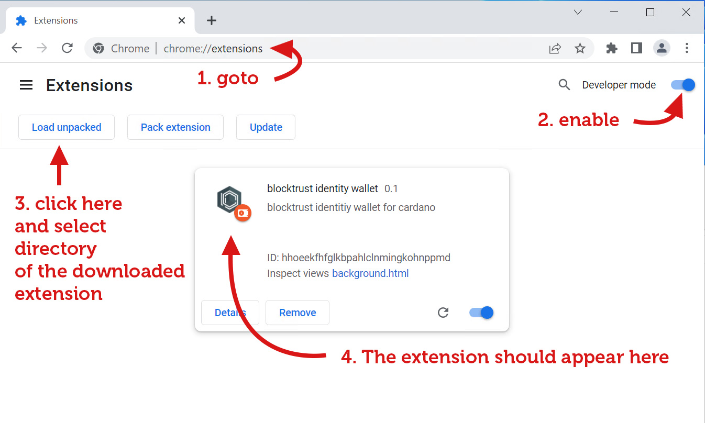
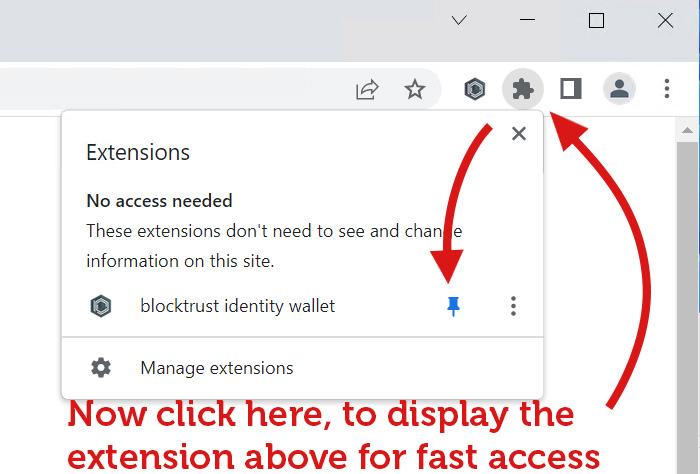

# blocktrust-identity-wallet
A browser wallet for Atala PRISM

## Current release (WIP)
https://btpublicreleases.blob.core.windows.net/blocktrusttidentitywallet/blocktrust-identitywallet-20230219.1.zip

## Older releases
https://btpublicreleases.blob.core.windows.net/blocktrusttidentitywallet/blocktrust-identitywallet-20230117.4.zip
https://btpublicreleases.blob.core.windows.net/blocktrusttidentitywallet/blocktrust-identitywallet-20221210.2.zip
https://btpublicreleases.blob.core.windows.net/blocktrusttidentitywallet/blocktrust-identitywallet-20221206.3.zip
https://btpublicreleases.blob.core.windows.net/blocktrusttidentitywallet/blocktrust-identitywallet-20221127.17.zip

## How to run
Currently you have to sideload the extension yourself and can’t just download it from the Chrome/Edge/Firefox Webstore.
But it's straightforward:
1.	Download the extension from one of the links above
2.	Open Chrome → Extensions
3.	Enable the developer mode
4.	Click on “Load unpacked”
5.	Point it to the right directory and click Ok. If you get an error-message it usually means you are in the wrong directory 😉
6.	The extension is now loaded. Pin the icon to have directly accessible.
7.	Have fun trying it out

# For testing SignIn/Website interaction
The website interaction is currently under development. You can see a very simple example here: https://archpublisher.de/test.html
After installation of the wallet click the buttons on this page to try out the different scenarios we are currently supporting

## Contact
For further information feel free to contact me at: sandmann@blocktrust.dev
